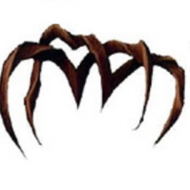

<html>

<b>Twisting With the Rune</b>

<b>Mod for EET and
BGEE/SoD</b>

The Twisted Rune is a highly secret cabal of liches and other powerful undead spellcasters. The inner circle is unknown even to members and employs agents to do their bidding, most of whom are unaware that they work for the Rune. Since the Year of the Dracorage the Rune has become the most powerful organization in southwestern Faerun, with agents in every country south of the High Moor and west of the Storm Horn Mountains. (from Forgotten Realms Wiki) 
In the game: During Shadows of Amn the protagonist can uncover a Twisted Rune hideout in the Bridge District. In this encounter the protagonist can kill Shangalar the Black and Shyressa, two Runemasters of the Twisted Rune. 
The mod comes in two parts, one for SoD and a second for ToB (the second part is only
available for EET and requires that she survived the first encounter.) 
 
The mod tries to make the existing encounter in SoA a bit more meaningful by providing a story of how the bhaalspawn received knowledge about the building and the entry method. Throughout the game a number of existing or new encounters provide some hints to the Rune's activities and the agents working for them, many do that unknowingly.
 
 
Features: 
- In EET you get a continuous story starting in BG1 and leading through SoD to SoA, however the mod can also be installed on the segregated game and may still make sense if you play the parts in the chronological sequence. (The BG2EE part simulates the player's knowledge he may have gained in earlier parts by letting him find an item among the inventory in the starting dungeon.) 
There is also some connection to Balthazar in ToB which appears in the original game but was never explained there (requires to be stronghold owner to trigger). 
The mod has no linear storyline, it is rather a puzzle where you find parts of the picture as you adventure through the game which may give you a vague idea of an organisation operating secretly in Faerun. The Rune has no interest in the bhaalspawn as such, the mod mainly provides some glue for events that originally appeared unrelated. 
 
Compatibility: The mod is compatible with the Cowled Menace mod that also expands the Twisted Rune topic. 
 
 
 
&nbsp;

&nbsp;

</body>

</html>
